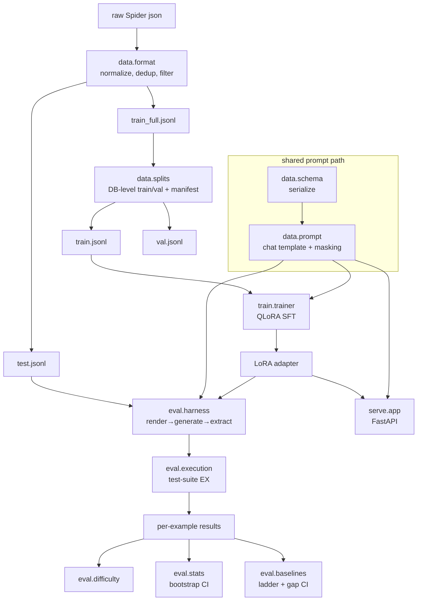

# Architecture

## One principle

**The prompt a model is trained on is byte-identical to the prompt it is evaluated and served on.** Everything below is organized to make that true and to keep evaluation trustworthy — not to make training convenient.

## Data flow

## Module responsibilities

| Package | Owns |
|---|---|
| `data` | schema serialization (the contract), prompt/chat-template + loss masking, DB-level splits, jsonl normalization |
| `train` | QLoRA config (4-bit NF4 + LoRA), SFT trainer + masked collator, W&B / EX-eval callbacks |
| `eval` | the harness (parity), extraction rule, test-suite execution accuracy, difficulty buckets, bootstrap CI, baseline ladder |
| `serve` | FastAPI app, model+adapter inference, observability, request/response schemas |
| `common` | config loading, logging, seeding |

## Parity, concretely

- `data.prompt.PromptBuilder.build_training_example` builds its prompt via the same `render_inference_prompt` the harness and server use — one code path.
- `tests/test_harness_parity.py` asserts the training prompt tokens equal the inference prompt tokens and that the prompt is masked (`-100`) while the completion is supervised.
- `serialize_kwargs` is the single dict that must match across train/eval/serve; it lives in the configs' `data:` block.

## Scoring seams (dependency injection)

The harness produces predictions; scoring is injected (`eval.execution.make_scorer`). The training callbacks take an `eval_fn`/`sample_fn`. This keeps the harness independent of the evaluator (testable with a stub) and lets the official Spider evaluator be vendored in without touching core code (`eval/official/`).